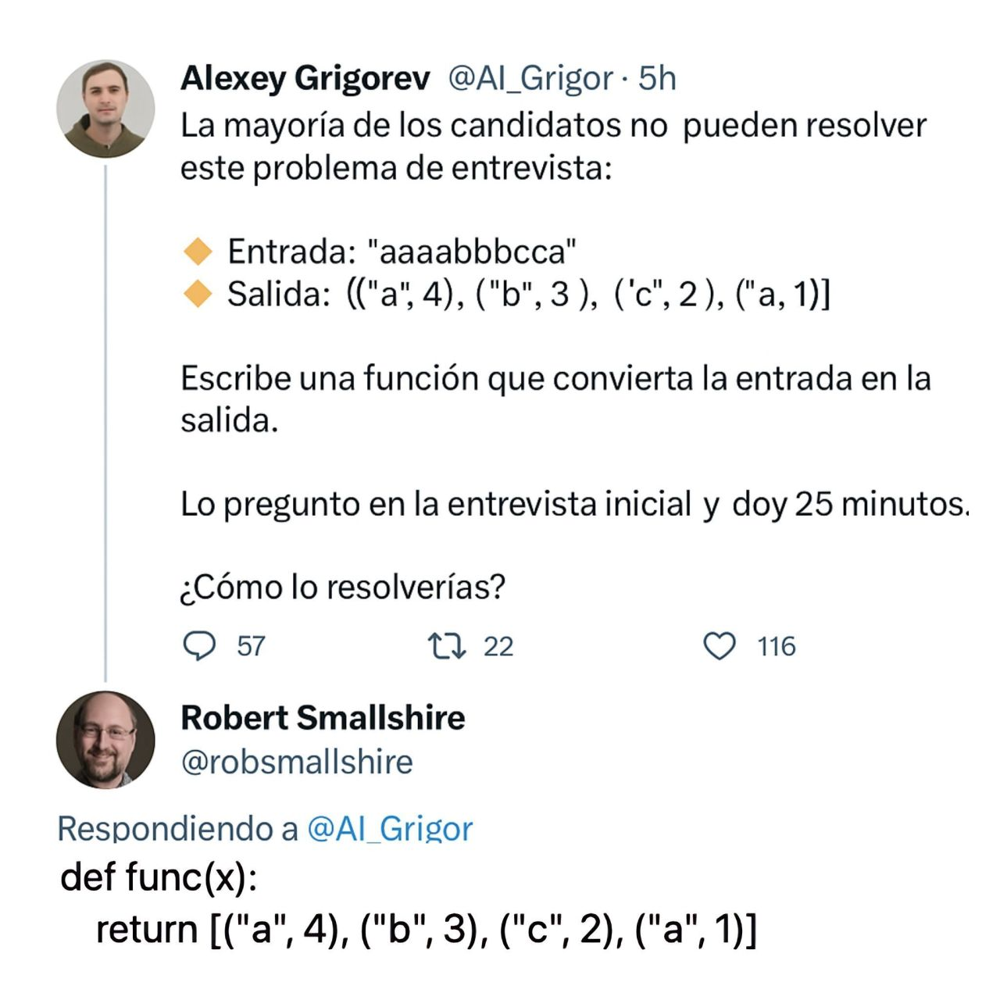

# MiduChallenge

## Solution to the MiduDev challenge

In this repository, I want to share my solution to a challenge I saw in a post by MiduDev. I decided to contribute my solution to the community because I found it interesting and I want to share different approaches in case there are better ways to do it, and to learn from them.



## Challenge Description

The problem consisted of grouping consecutive characters in a string and counting how many times they consecutively repeat. After analyzing it, I came up with a JavaScript solution that efficiently solves this challenge.

## My Solution

The solution is a function that goes through the string and groups consecutive characters, showing the number of repetitions of each.

```javascript
let string = "aaaabbbcca";

function solve(str) {
    let result = "";
    let count = 1;

    for (let i = 1; i < str.length; i++) {
        if (str[i] !== str[i - 1]) {
            result += `("${str[i - 1]}", ${count}), `;
            count = 1;
        } else {
            count++;
        }
    }

    // Add the last group
    result += `("${str[str.length - 1]}", ${count})`;

    // Wrap it in square brackets
    return `[${result}]`;
}

console.log(solve(string));
